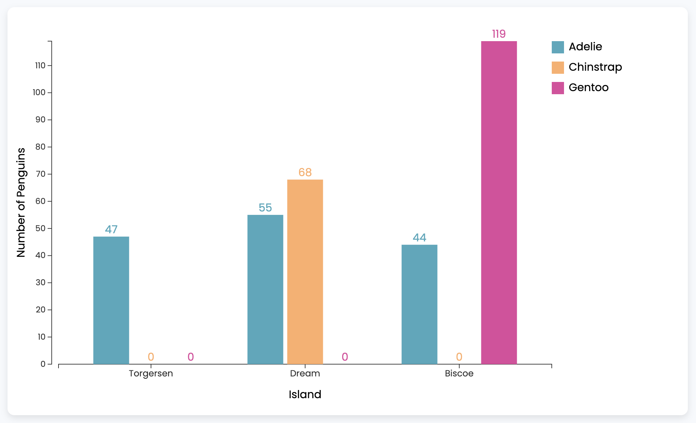
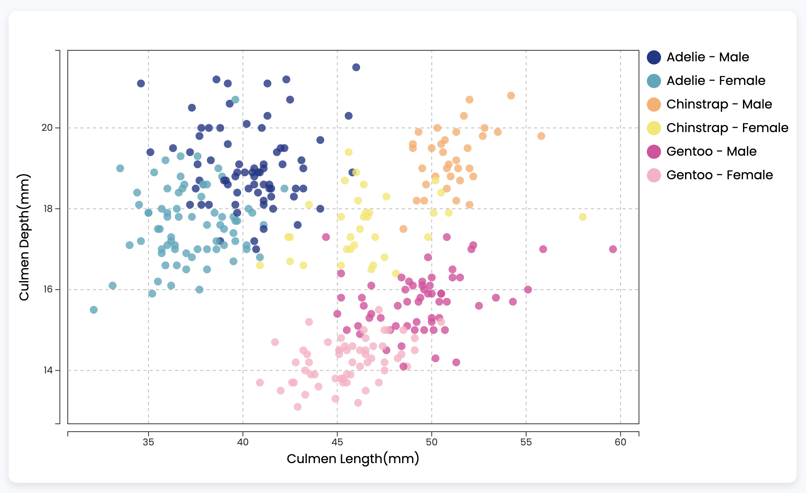

# Palmer Archipelago (Antarctica) Penguin Data Visualization

## Project Goal

We aim to visualize the geographical distribution and physical characteristics of three penguin species (Chinstrap, Adelie, or Gentoo) within the Palmer Archipelago in Antarctica.

## Data Source

[Palmer Archipelago (Antarctica) Penguin Data](https://www.kaggle.com/datasets/parulpandey/palmer-archipelago-antarctica-penguin-data)

## Description of the Data

All the data used in this project were collected by Dr. Kristen Gorman and the Palmer Station in Antarctica, part of the Long Term Ecological Research Network. We utilized the `penguins_size.csv` dataset as our primary data source, as it is a simplified version derived from the original penguin datasets. This dataset includes the following variables:

- `species`: The species of the penguin.The possible species are: Chinstrap, Adelie, or Gentoo.
- `culmen_length_mm`: The culmen length of the penguin in millimeters. The culmen is the upper ridge of a bird's beak.
- `culmen_depth_mm`: The depth of the penguin's culmen in millimeters.
- `flipper_length_mm`: The length of the penguin's flipper in millimeters.
- `body_mass_g`: The body mass of the penguin in grams.
- `island`: The island where the penguin was found. The possible locations are: Dream, Torgersen, or Biscoe, all of which are situated within the Palmer Archipelago in Antarctica.
- `sex`: The sex of the penguin: male or female.

We visualized `species`, `culmen_length_mm`, `culmen_depth_mm`, `island`, and `sex` in our project.

## Design Rationale & Insights

### Graph 1: Geographic Distribution

_Chart Design:_ We opted for a grouped bar chart to depict the geographic distribution of three penguin species. Instead of utilizing a map, we chose this approach because the dataset comprises only three islands, which are sparsely located in Antarctica. Plotting all this data on a large map would be ineffective and challenging to interpret. On the contrary, a grouped bar chart proves effective in illustrating comparisons across multiple categories. In our case, each island serves as a primary category, while the species are treated as sub-categories. This design allows users to compare the number of penguins across different species within the same island and also facilitates cross-island comparisons for a particular species.

_Marks & Visual Channels:_ We used rectangles as marks, because this shape is easier to read, compare, and align. The height, color, and horizontal position of each rectangle are visual channels. The height of each rectangle is proportional to the value it represents. Different species are represented by distinct colors. The horizontal position represents each island. In our graph, our rectangles are well aligned to facilitate direct comparisons. We also added space between bar groups to assist users in distinguishing between categories.

_Color Scheme:_ Distinct colors were assigned to each species to ensure clarity. Indigo, orange, and pink hues were chosen for their visual differentiation, ensuring that users could easily distinguish between the Adelie, Chinstrap, and Gentoo species respectively. To maintain cohesiveness, this color scheme is employed in both graphs.

_Axes:_ The x and y axes are labeled with clear and legible fonts. The y axis provides information on the number of penguins, while the x axis displays 3 islands with names. This ensures that even audiences who are unfamiliar with the dataset can grasp the core information about the visualization quickly.

_Legend:_ The legend is placed on the top right corner of the main chart area, which ensures that it does not interfere with the main visualization, yet remains in the audiences’ vision for easy reference. The use of squares in the legend directly correlates with the rectangular shapes of the bars in the graph, maintaining consistency of the design elements.

_Insights & Story:_ This graph depicts the geographic distribution of three species of penguins across three different locations: Torgersen, Dream, and Biscoe. In Torgersen, there's a **notable presence of Adelie penguins** with a count of 47, while **Chinstrap and Gentoo penguins are absent**. Dream Island displays a more **diverse** distribution with 55 Adelie and 68 Chinstrap penguins, but **no Gentoos**. Biscoe, on the other hand, has a **predominant Gentoo population** of 119, accompanied by 44 Adelies, and **no Chinstraps**. Another interesting fact is that **Adelie penguins are widely distributed** across all three islands. This distribution showcases the varying habitat preferences of these penguin species across the three locations.

### Graph 2: Culmen Dimension Across Species & Sexes

_Marks & Visual Channels:_ We chose to use circles as marks for the data because we wanted to present each data point (representing a penguin) separately. As we wanted to convey the relationship that penguin species and sex have on their culmen size, we used color as a visual channel to encode the penguin species and sex and x and y position on a common scale to encode the culmen length and depth data for each penguin.

_Data Cleaning:_ To construct the graph, we first had to preprocess the data. One issue with the data is that the culmen length, culmen depth, and sex for certain data points was missing. We fixed this issue by removing any data points with missing data and converting the culment length and culmen depth data to the javascript number type.

_Axes & Scales:_ We chose an amount of axis labels on the culmen length and depth axes that provided enough labels to interpret the culmen length and depth of any individual penguin without cluttering both axes. We also chose a linear scale for both axes as the data was distributed relatively evenly on both axes and a linear scale is easier to interpret for the reader.

_Color Scheme & Styles:_ For the circle elements corresponding to each data point, we chose to vary the hues of the colors corresponding to each species, because each species is a different category. We used blue, yellow, and pink as the primary hues of the three species. For each species, we differentiated the sex by varying the luminosity of each hue. In this way, distinct luminosity sets different sex apart while still maintaining a common hue within the same species. We also chose to set the radius of circles to 5 pixels so that each point would be large enough to see without overlapping significantly with surrounding data points. Additionally, we slightly decreased the opacity of the circles so that overlapping circles don’t obscure each other in order to increase the visibility of the data to the reader.

_Labels & Legend:_ To make the tick labels and corresponding units easier to interpret for the reader, we added the axes labels “Culmen Length (mm)” and “Culmen Depth (mm)” to the x and y axes respectively. Additionally, we added a buffer to x and y axes to prevent data points from touching the axes and give our graph a cleaner look. The use of circles in the legend directly correlates with the shapes of the circles in the graph, maintaining consistency of the design elements.

_Insights & Story:_ This graph presents the culmen length and depth measurements of male and female penguins from three different species. The analysis of culmen dimensions across different penguin species and sex reveals distinct patterns. **Males consistently exhibit longer and deeper culmen compared to females across all species.** In terms of species-specific differences, **Adelie penguins have the most pronounced culmen**, both in length and depth, standing out as the foremost. They are followed by the Chinstrap penguins, while **the Gentoo penguins have the least pronounced culmens** among the three species. Furthermore, when observing the data, each combination of species and sex forms its own clear and discernible cluster, highlighting the specific culmen dimensions unique to each group.

## Contributors

- Stanley Jiang
- Phyllis Ju
- Marta Liang
- Raymond Zhang
